# Laboratorio 02 — Estrategias de Trading con Análisis Técnico

**Microestructuras y Sistemas de Trading (ITESO) · Equipo 2 · Nivel C**  
Integrantes: Milca (TSLA, NFLX), Paula (META, AMZN), Arturo (NVDA, GOOGL).

## 1. Resumen ejecutivo

Construimos un sistema de trading multi-activo sobre seis acciones tecnológicas de gran capitalización (NVDA, AMZN, TSLA, META, NFLX, GOOGL) con datos diarios de 2015-01-02 a 2026-08-31. Cada activo opera largo y corto con tres indicadores de familias distintas (cruce de EMAs, RSI y Bandas de Bollinger) y la regla de confirmación 2 de 3; las salidas son por stop-loss y take-profit en múltiplos de ATR, señal contraria o time-stop. Un detector de régimen (K-means) clasifica el mercado en Tendencia, Reversión o Crisis, los parámetros se optimizan por régimen con Optuna maximizando el Calmar en un walk-forward de 6 meses → 1 mes, y las posiciones se agregan en un portafolio de Risk Parity con costos de 0.125% por lado y sin apalancamiento.

En el tramo fuera de muestra del walk-forward dentro de TRAIN (2016-01-04 a 2024-04-26), el portafolio Risk Parity obtuvo un CAGR de -0.7%, Sharpe de -0.10, drawdown máximo de 15.8% y Calmar de -0.04, frente a un Calmar de -0.07 con pesos iguales y 0.76 del Buy & Hold. La eficiencia del walk-forward (WFE) es -0.07 en rendimiento anualizado (-0.01 en Calmar). En TEST, con el sistema congelado, el CAGR fue -0.5%, el MDD 7.1% y el Calmar -0.06 (Buy & Hold: 28.6%).

**Conclusión:** el sistema no genera rendimiento ajustado por riesgo positivo fuera de muestra, así que la evidencia no respalda una ventaja real; 1 de 13 parámetros/multiplicadores muestran un pico (el Calmar cambia más de 50% o de signo con ±20%); el Calmar del sistema queda por debajo del Buy & Hold en el mismo periodo; antes de costos el sistema gana $49,078, pero con 0.125% por lado y una rotación de 5.3 veces al año los costos se lo comen.

## 2. Datos, auditoría y selección de activos

Fuente: Yahoo Finance mediante `yfinance` con `auto_adjust=True` (precios ajustados por splits y dividendos, para que los rendimientos sean comparables y no aparezcan saltos artificiales). Los datos se congelaron en `data/prices_daily.csv`; `main.py` nunca vuelve a descargar si el archivo existe.

| Activo | Días | Faltantes | Duplicados | Viol. OHLC | Rend. diario > ±25% |
|---|---|---|---|---|---|
| NVDA | 2,932 | 0 | 0 | 0 | 2016-11-11:+29.8% |
| AMZN | 2,932 | 0 | 0 | 0 | — |
| TSLA | 2,932 | 0 | 0 | 0 | — |
| META | 2,932 | 0 | 0 | 0 | 2022-02-03:-26.4% |
| NFLX | 2,932 | 0 | 0 | 0 | 2022-04-20:-35.1% |
| GOOGL | 2,932 | 0 | 0 | 0 | — |

Los rendimientos extremos corresponden a eventos reales de resultados trimestrales (no a splits mal ajustados): los splits de NVDA, TSLA, AMZN, GOOGL y NFLX no producen saltos en la serie ajustada.

**Split cronológico sin traslape:** TRAIN = primer 80% (2015-01-02 a 2024-04-26, 2,345 días) y TEST = último 20% (2024-04-29 a 2026-08-31, 587 días, ≈ 2.3 años). El periodo incluye Q4 2018, COVID 2020, el bear market de 2022 y el choque de abril de 2025, necesarios para que el régimen de Crisis tenga observaciones.

**Asignación de activos:** la lista ['NVDA','AMZN','TSLA','META','NFLX','GOOGL'] se repartió aleatoriamente con `random.seed(42)`: Milca → TSLA, NFLX; Paula → META, AMZN; Arturo → NVDA, GOOGL.

**Sesgos.** (i) *Supervivencia y selección*: son empresas que hoy sabemos ganadoras, así que el Buy & Hold es un benchmark muy difícil de vencer en retorno; el sistema se juzga por Calmar y riesgo. (ii) *Diversificación limitada*: los seis son mega-cap growth tech con correlación alta; la diferencia entre Risk Parity y pesos iguales viene sobre todo de las diferencias de volatilidad (TSLA y NVDA más volátiles que AMZN o GOOGL).

## 3. Indicadores y regla de confirmación

| Familia | Indicador | Fórmula | Voto s_i |
|---|---|---|---|
| Tendencia | Cruce de EMAs | EMA_t = α·P_t + (1−α)·EMA_{t−1}, α = 2/(h+1) | +1 si EMA_rápida > EMA_lenta; −1 si es menor |
| Momento | RSI (Wilder) | RSI = 100 − 100/(1 + RS), RS = Wilder(G)/Wilder(L) | +1 si RSI < umbral_inf; −1 si RSI > umbral_sup |
| Volatilidad | Bollinger | MB = SMA_N, UB/LB = MB ± k·σ_N | +1 si C < LB; −1 si C > UB; 0 dentro |

El ATR de Wilder (TR_t = max(H−L, |H−C_{t−1}|, |L−C_{t−1}|), ventana 14) no vota: coloca SL y TP.

**Regla de confirmación (2 de 3):**

    S_t = +1  si  Σ_i 1[s_i,t = +1] ≥ 2
    S_t = −1  si  Σ_i 1[s_i,t = −1] ≥ 2
    S_t =  0  en otro caso (sin nueva apertura)
    Fuerza_t = max(Σ_i 1[s_i,t = +1], Σ_i 1[s_i,t = −1]) ∈ {2, 3}

**Fuerza continua para el tamaño (clase de Risk Parity, paso 7.2):** si la compuerta 2 de 3 se cumple, s_t = (1/3)·Σ_j x_j,t ∈ [−1, 1]; si no, 0. Así una señal 3 de 3 entra con |s| = 1, una 2 de 3 limpia con 2/3 y una mixta (dos a favor y uno en contra) con 1/3. La compuerta de la clase es |Σ_j x_j| ≥ 2, que no abriría las señales mixtas; conservamos la regla del lineamiento ("al menos 2 de 3 coinciden") y la diferencia queda reflejada en el tamaño: una señal mixta pesa la mitad que una 2 de 3 limpia.

**Interpretación económica:** la regla abre en dos situaciones: un *pullback* dentro de una tendencia (EMA + un oscilador de acuerdo) o una reversión fuerte contra la tendencia (RSI y Bollinger de acuerdo). Todo se calcula con datos hasta el cierre de t y se ejecuta en el open de t+1.

La correlación entre los votos RSI–Bollinger va de 0.26 a 0.45 (umbral de redundancia 0.7) y la de EMA con los osciladores es negativa (-0.50 a -0.05): los indicadores aportan información distinta.

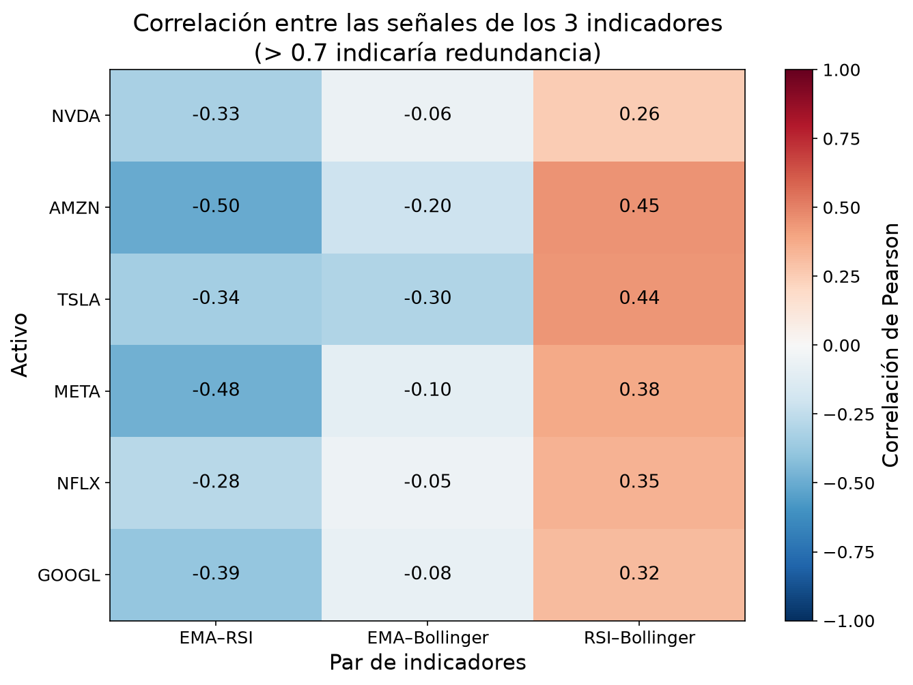

*Figura: correlación entre las señales de los tres indicadores.*

## 4. Motor de backtesting y convenciones

- **Event-driven** con estado explícito: efectivo, cantidad con signo, precio de entrada, SL/TP y valor diario.
- **Orden de eventos:** (1) open de t: stops por gap y órdenes pendientes; (2) durante t: SL/TP con high/low; (3) cierre de t: marca a mercado y decisiones con datos ≤ t para el open de t+1.
- **SL primero** si SL y TP caen en la misma barra (conservador). **Gap:** si el open ya rebasó el nivel, se ejecuta al open.
- **SL/TP con ATR:** largo SL = P_in − m_sl·ATR, TP = P_in + m_tp·ATR (al revés en cortos), fijos al entrar.
- **Costos:** 0.125% del nocional en cada apertura y cada cierre. Compra: Cash −= q·P·(1+c); venta: Cash += q·P·(1−c).
- **Cortos:** la venta abre la posición y registra el pasivo; Equity = Cash + Σ q_i·P_i con q_i < 0 en cortos.
- **Sin apalancamiento:** q* = w·E*/(P·(1+c)), de modo que nocional + comisión ≤ capital; si Σ|q·P| > equity (un corto perdedor), la posición se recorta al open siguiente.

Exposición bruta máxima tras ejecutar: 0.67 (al cierre, por la deriva intradía, 0.67). Operaciones del portafolio RP en WF-OOS: 248 largas y 376 cortas.

## 5. Optimización y walk-forward

Optuna con `TPESampler` (30 trials aleatorios y luego bayesiano) maximiza el Calmar con 100 trials por estudio: en cada ventana y activo, 1 estudio global y 1 por régimen (θ_{i,j} = argmax Calmar(backtest(train_k | S_t = j))). Restricción: un θ con menos de 10 operaciones (global) o 5 (régimen) recibe −10⁹. Purga: las posiciones se cierran el último día del train; embargo: los últimos 5 días no entran al objetivo. Se usa el **θ robusto** (mediana del 10% de mejores trials, centro de la meseta), no el argmax.

| Parámetro | Rango | Justificación |
|---|---|---|
| ema_fast | 5–30 | 1 a 6 semanas, horizonte de las operaciones |
| ema_gap | 10–100 | lenta = rápida + gap (lenta > rápida) |
| rsi_window | 7–28 | alrededor del estándar de Wilder (14) |
| rsi_lower / rsi_upper | 20–40 / 60–80 | alrededor de 30/70 |
| bb_window / bb_k | 10–40 / 1.5–3.0 | alrededor de 20 días y 2σ |
| m_sl / m_tp | 1–4 / 1–6 ATR | fuera del ruido diario; payoff > 1 posible |
| max_hold | 5–40 días | time-stop de 1 a 8 semanas |

**Cómputo:** 100 ventanas de walk-forward + 1 final; tiempo total de optimización 63.1 minutos con 7 procesos en paralelo y **460,800 configuraciones evaluadas** en total (todas las variantes).

**Fallback** (θ global cuando el régimen tiene < 20 días en el train o ningún trial cumple el mínimo de operaciones), variante elegida: Tendencia 277, Reversión 337 y Crisis 602 de 606 estudios por régimen.

| Variante | Calmar WF-OOS | CAGR WF-OOS | CAGR WF-IS prom. | WFE (retorno) | WFE (Calmar) | Elegida |
|---|---|---|---|---|---|---|
| por_activo | -0.04 | -0.7% | 10.5% | -0.07 | -0.01 | sí |
| compartido | -0.09 | -1.6% | 3.5% | -0.46 | -0.05 | no |
| anclado_por_activo | -0.12 | -3.2% | 10.3% | -0.31 | -0.05 | no |

La variante oficial (**por_activo**) se eligió por el mayor Calmar WF-OOS dentro de TRAIN, antes de tocar TEST.

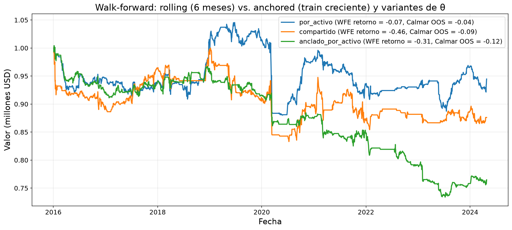

*Figura: walk-forward rolling vs. anchored.*

## 6. Métricas por conjunto, activo y régimen

| Conjunto | Sistema | CAGR | Sharpe | Sortino | MDD | Calmar | Win rate | Operaciones |
|---|---|---|---|---|---|---|---|---|
| WF-IS | RP | 10.5% | 1.83 | 3.77 | 3.0% | 6.26 | 55.3% | 41 |
| WF-IS | EW | 11.6% | 1.85 | 3.90 | 3.2% | 6.52 | 55.3% | 41 |
| WF-IS | Buy & Hold | 50.9% | 1.43 | 2.22 | 18.5% | 4.63 | 71.0% | 6 |
| WF-OOS | RP | -0.7% | -0.10 | -0.13 | 15.8% | -0.04 | 42.1% | 624 |
| WF-OOS | EW | -1.3% | -0.21 | -0.28 | 18.5% | -0.07 | 42.0% | 624 |
| WF-OOS | Buy & Hold | 46.1% | 1.21 | 1.77 | 60.9% | 0.76 | 100.0% | 6 |
| TEST | RP | -0.5% | -0.06 | -0.08 | 7.1% | -0.06 | 46.0% | 176 |
| TEST | EW | -0.3% | -0.04 | -0.05 | 7.1% | -0.05 | 46.0% | 176 |
| TEST | Buy & Hold | 28.6% | 1.01 | 1.50 | 28.8% | 0.99 | 100.0% | 6 |

WF-IS es el promedio de las métricas in-sample de cada ventana de 6 meses (sus trains se traslapan); WF-OOS es la simulación continua de los meses de prueba concatenados.

**Rendimientos anuales (WF-OOS):**

| Año | RP | EW | Buy & Hold |
|---|---|---|---|
| 2016 | -5.4% | -5.5% | 43.9% |
| 2017 | -1.1% | -1.3% | 61.5% |
| 2018 | 8.5% | 8.6% | -7.1% |
| 2019 | -0.0% | -0.5% | 43.9% |
| 2020 | -3.5% | -4.9% | 150.0% |
| 2021 | -4.5% | -5.7% | 66.1% |
| 2022 | -0.8% | -0.4% | -54.8% |
| 2023 | 4.0% | 2.1% | 168.7% |
| 2024 | -2.2% | -2.5% | 48.0% |

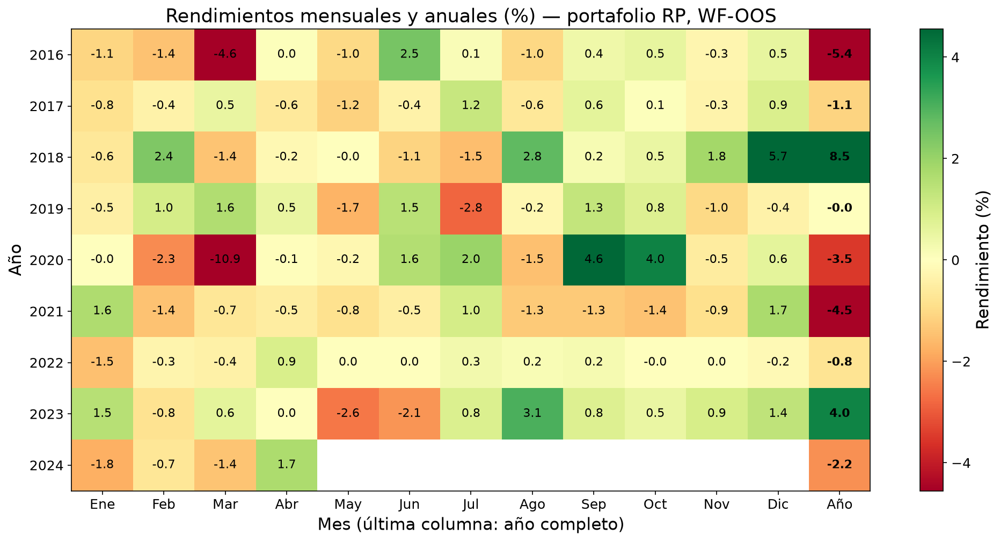

*Figura: rendimientos mensuales y anuales del portafolio RP.*

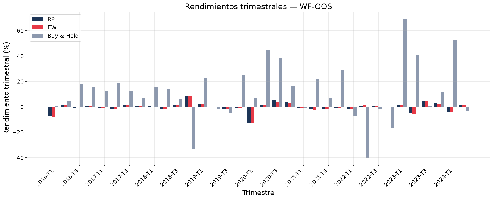

*Figura: rendimientos trimestrales.*

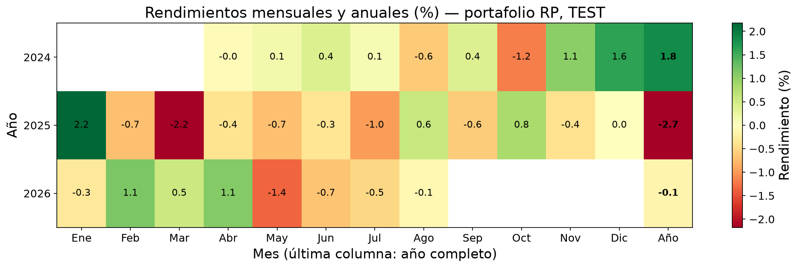

*Figura: rendimientos mensuales en TEST.*

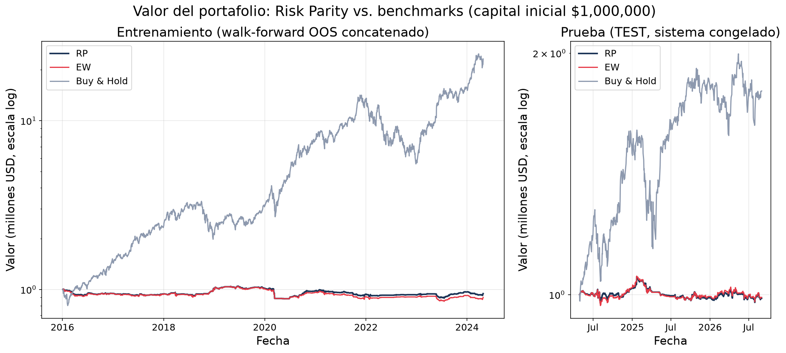

*Figura: valor del portafolio en entrenamiento y prueba.*

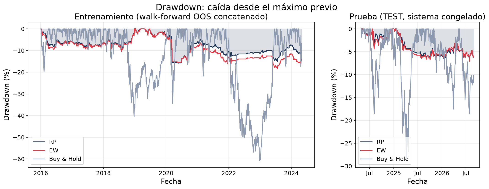

*Figura: curva de drawdown.*

## 7. Análisis de régimen

**Metodología.** Un régimen único para los seis activos, calculado sobre su índice equiponderado con K-means (K = 3 por teoría: tendencia, reversión y crisis; `n_init=10`, `random_state=42`). Features en ventana móvil de 63 días (3 meses): volatilidad realizada (separa Crisis), ATR normalizado, fuerza de tendencia |ln(MA_21/MA_63)|/σ, R² de ln(precio) contra el tiempo (tendencia lineal vs. rango) y autocorrelación lag-1 (persistencia vs. reversión). El scaler y K-means se ajustan solo con datos ≤ fin del train de cada ventana; fuera de él solo se predice.

**Selección de features (solo TRAIN):** con las 5 features el silhouette es 0.315 (< 0.4), así que se usa el subconjunto con mayor silhouette: **volatilidad + r2_tendencia**. La autocorrelación con 63 datos tiene error estándar ≈ 1/√63 ≈ 0.13, mayor que la diferencia entre centroides; ATR normalizado y fuerza de tendencia son redundantes con volatilidad y R².

| Subconjunto | Silhouette |
|---|---|
| volatilidad+r2_tendencia | 0.473 |
| atr_norm+r2_tendencia | 0.457 |
| volatilidad+atr_norm+r2_tendencia | 0.448 |
| volatilidad+fuerza_tendencia | 0.417 |
| atr_norm+fuerza_tendencia | 0.407 |
| volatilidad+fuerza_tendencia+r2_tendencia | 0.400 |

**Adaptación a datos diarios.** Los lineamientos piden actualizar cada 1–6 horas con barras de 5 minutos; en diario se reclasifica cada 5 días hábiles (semanal, alineado con el rebalanceo) y un cambio se confirma solo si aparece en 2 actualizaciones seguidas. El objetivo de persistencia (> 12 h en 5 minutos) se adapta a ≥ 10 días hábiles: el régimen debe durar más que una operación típica para que los parámetros por régimen tengan sentido.

| Validación | Valor | Objetivo |
|---|---|---|
| Silhouette (promedio de ventanas) | 0.468 | > 0.4 |
| Silhouette (mínimo / modelo final) | 0.388 / 0.473 | > 0.4 |
| Duración promedio (días) | 49.8 | ≥ 10 |
| Transiciones por año | 4.9 | — |

| Régimen | % del tiempo | Episodios | Duración observada | E[D] = 1/(1−A_jj) |
|---|---|---|---|---|
| Tendencia | 40.3% | 17 | 49.6 | 52.6 |
| Reversión | 33.2% | 14 | 49.6 | 49.6 |
| Crisis | 26.5% | 11 | 50.5 | 50.5 |

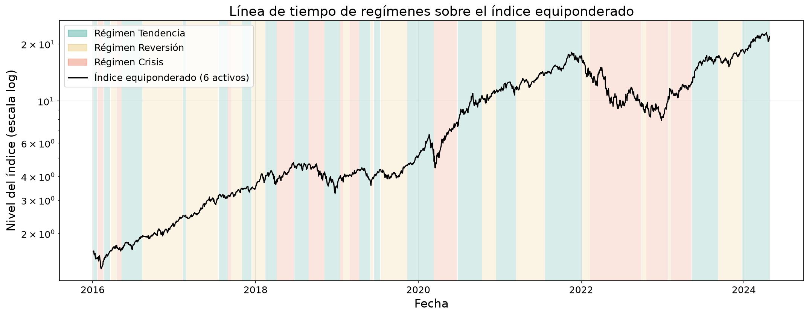

*Figura: línea de tiempo de regímenes.*

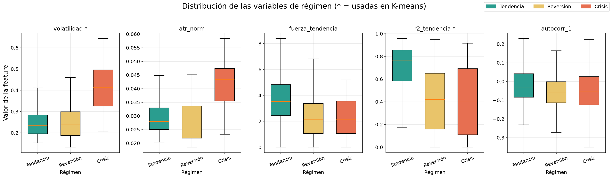

*Figura: distribución de las features por régimen.*

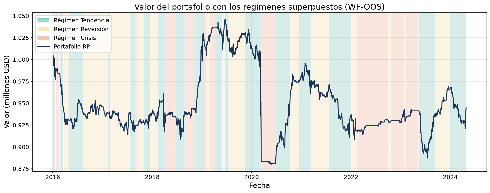

*Figura: valor del portafolio con regímenes superpuestos.*

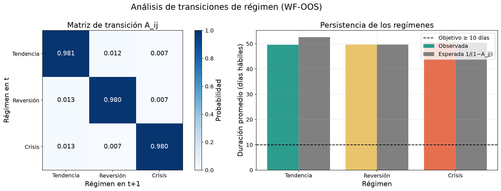

*Figura: matriz de transición y persistencia.*

**Transiciones:** 41 cambios de régimen en WF-OOS, 30 con posiciones abiertas (78 posiciones afectadas) y 11 entradas a Crisis. Regla: la posición abierta conserva su SL/TP; las entradas nuevas usan el θ del régimen nuevo; el multiplicador nuevo se aplica en el siguiente rebalanceo, salvo al entrar a Crisis, que rebalancea de inmediato a M = 0.3 y solo admite entradas 3 de 3.

**Métricas por régimen (WF-OOS).** El rendimiento del día t se atribuye al régimen vigente al cierre de t−1. IC bootstrap al 95% (1000 remuestreos, semilla 42) de la media diaria, en puntos base:

| Sistema | Régimen | Días | Media anualizada | Sharpe | MDD | IC 95% media diaria (pb) |
|---|---|---|---|---|---|---|
| RP | Tendencia | 842 | -3.4% | -0.46 | 16.1% | [-4.5, 1.6] |
| RP | Reversión | 695 | 2.4% | 0.62 | 3.9% | [-1.1, 2.9] |
| RP | Crisis | 555 | 0.1% | 0.04 | 5.2% | [-2.0, 1.5] |
| EW | Tendencia | 842 | -5.0% | -0.67 | 20.0% | [-5.3, 1.1] |
| EW | Reversión | 695 | 2.1% | 0.50 | 4.3% | [-1.3, 2.8] |
| EW | Crisis | 555 | 0.7% | 0.21 | 5.1% | [-1.7, 1.7] |
| Buy & Hold | Tendencia | 842 | 53.5% | 1.49 | 34.1% | [6.4, 37.6] |
| Buy & Hold | Reversión | 695 | 53.6% | 1.86 | 25.9% | [8.7, 34.1] |
| Buy & Hold | Crisis | 555 | 20.2% | 0.44 | 52.9% | [-16.3, 32.5] |

Prueba de Kruskal-Wallis (H0: misma distribución de rendimientos diarios entre regímenes) para el portafolio RP: p = 0.094.

**Estabilidad fuera de muestra (TRAIN WF-OOS vs. TEST):**

| Régimen | % tiempo TRAIN | % tiempo TEST | Duración TRAIN | Duración TEST |
|---|---|---|---|---|
| Tendencia | 40.3% | 51.1% | 49.6 | 50.0 |
| Reversión | 33.2% | 36.1% | 49.6 | 30.3 |
| Crisis | 26.5% | 12.8% | 50.5 | 75.0 |

## 8. Metodología del portafolio

**Del retorno al riesgo del portafolio.** R_p = Σ_i w_i R_i, σ_p² = wᵀΣw y σ_p = √(wᵀΣw). La contribución marginal es ∂σ_p/∂w_k = (Σw)_k/σ_p = Cov(R_k, R_p)/σ_p y la contribución total RC_i = w_i·(Σw)_i/σ_p; por el Teorema de Euler (σ_p es homogénea de grado 1) Σ_i RC_i = σ_p exactamente, así que RC_i/σ_p es un porcentaje genuino del riesgo.

**Risk Parity.** Se busca RC_i = σ_p/n para todo i con Σw_i = 1 y w_i > 0. Minimizar Σ(RC_i − RC_j)² directamente no es convexo y depende del punto de partida, así que se usa la formulación convexa de Spinu (2013), resuelta con SLSQP:

    min_{y>0}  ½·yᵀΣy − (1/n)·Σ_i ln y_i,      w = y / Σ_j y_j

(forma cuadrática PSD + barrera logarítmica ⇒ convexa, solución única). Verificación numérica en cada rebalanceo: max|RC_i/σ_p − 1/n| < 10⁻⁴; si falla se lanza una excepción (también es prueba automatizada, junto con los ejemplos numéricos de la clase).

**Tres versiones de pesos** (mismas señales, costos, rebalanceo y multiplicadores): pesos iguales w_i = 1/n; RP naïve w_i = (1/σ_i)/Σ_j(1/σ_j), exacta solo si todas las correlaciones son iguales; y RP optimizado (Spinu).

| Ponderación | CAGR | MDD | Calmar | Sharpe | Turnover anual | Costos |
|---|---|---|---|---|---|---|
| Pesos iguales | -1.3% | 18.5% | -0.07 | -0.21 | 5.31 | $103,274 |
| RP naïve (1/σ) | -0.4% | 15.4% | -0.02 | -0.04 | 5.25 | $105,014 |
| Risk Parity (Spinu) | -0.7% | 15.8% | -0.04 | -0.10 | 5.27 | $104,402 |

**Estimación de Σ** (siempre sobre rendimientos, nunca precios). Oficial: muestral de 126 días con datos ≤ t (n/T ≈ 0.05, número de condición mediano 34.5). Como pide la clase, se compararon los pesos de RP con tres estimadores; la estabilidad es el cambio medio ½Σ|Δw^RP| entre fechas semanales consecutivas:

| Estimador | Cambio medio de pesos | Cambio máximo | κ(Σ) mediano |
|---|---|---|---|
| muestral | 0.009 | 0.067 | 28.6 |
| ewma | 0.038 | 0.196 | 37.6 |
| ledoit_wolf | 0.008 | 0.059 | 13.6 |

EWMA (λ = 0.94, T_eff ≈ 17 días) reacciona más rápido pero mueve más los pesos; Ledoit-Wolf encoge los eigenvalores extremos y suaviza los pesos frente a la muestral.

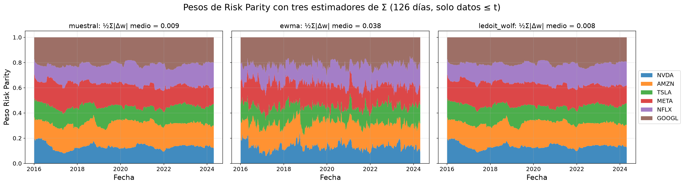

*Figura: pesos de Risk Parity con tres estimadores de Σ.*

**¿Por qué Risk Parity?** Es una decisión de asignación de riesgo, no de retorno: no necesita rendimientos esperados (el insumo más ruidoso de Markowitz), y *equal weight no es equal risk*: con pesos iguales TSLA y NVDA dominan el riesgo. RP penaliza la volatilidad propia y también la covarianza con el resto.

**Agregación de señales (paso 7).** Dos objetos independientes: w^RP dice cuánto riesgo puede tomar cada activo y s_i ∈ [−1, 1] qué tan convencido está el sistema de la dirección:

    w̃_i = w_i^RP · s_i,      w^target = m(régimen) · w̃ / max(1, Σ_i |w̃_i|)

con m = 1.0 / 0.7 / 0.3 en Tendencia / Reversión / Crisis (en Crisis además solo se abren señales 3 de 3). Conflictos entre activos correlacionados: si corr_126(i, j) > 0.7 y las direcciones son opuestas, gana la de mayor |s| y la otra queda en 0; si empatan, ambas reducen s a la mitad (26 conflictos en WF-OOS, 5 empates). El resultado de RP no es el portafolio final: se combina con las señales y el régimen antes de llegar a una orden.

**Rebalanceo (paso 8).** Turnover T_t = ½·Σ_i |w_i,t − w_i,t⁻| contra los pesos *después del drift* (el factor ½ cuenta un viaje redondo una vez) y costo anual ≈ T̄·f·2c. Disparador híbrido: en fechas de calendario (cada f días) se rebalancea solo si ‖w_t⁻ − w^target‖₁ > δ; al entrar a Crisis, de inmediato; las entradas y salidas por señal, SL, TP o time-stop se ejecutan siempre al open siguiente. f y δ se eligieron con la malla del barrido (sección 11) por Calmar WF-OOS dentro de TRAIN: **f = 10 días, δ = 0.20**. Rebalanceos por año: 2.0, T̄ por rebalanceo 10.1%, costo anual de rebalanceo ≈ 0.05%; revisiones de calendario omitidas por estar dentro de la banda: 204. Turnover total (incluye entradas y salidas por señal): 5.3 veces el capital al año.

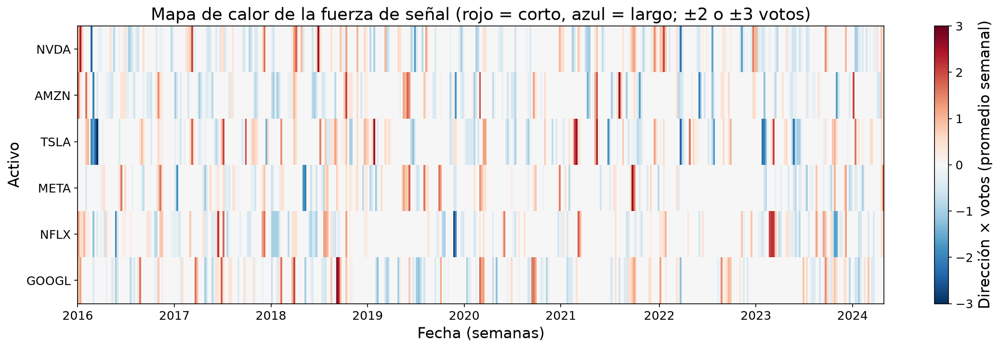

*Figura: mapa de calor de la fuerza de señal.*

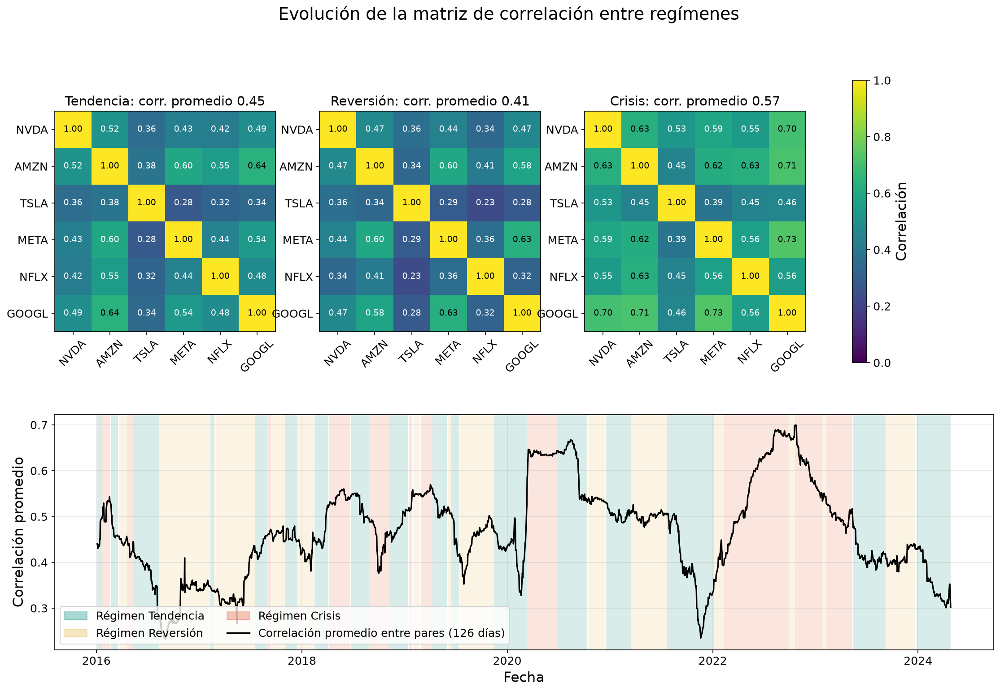

*Figura: evolución de la matriz de correlación entre regímenes.*

## 9. Estrategia individual de cada activo

El diseño (indicadores, regla 2 de 3, SL/TP con ATR, time-stop) es común; cada activo tiene su propio θ por régimen en cada ventana. θ congelado para TEST (última ventana de TRAIN):

| Integrante | Activo | Régimen | EMA rápida/lenta | RSI (umbrales) | Bollinger (N, k) | SL / TP (ATR) | max_hold |
|---|---|---|---|---|---|---|---|
| Milca | TSLA | Tendencia | 6/48 | 10 (27–79) | 14, 1.66 | 1.27 / 2.28 | 36 |
| Milca | TSLA | Reversión | sin θ válido | — | — | — | — |
| Milca | TSLA | Crisis | sin θ válido | — | — | — | — |
| Milca | NFLX | Tendencia | 23/119 | 20 (22–62) | 17, 1.85 | 3.70 / 4.23 | 9 |
| Milca | NFLX | Reversión | 22/53 | 25 (30–61) | 12, 1.63 | 3.59 / 2.74 | 10 |
| Milca | NFLX | Crisis | 22/53 | 25 (30–61) | 12, 1.63 | 3.59 / 2.74 | 10 |
| Paula | META | Tendencia | 18/71 | 15 (38–62) | 14, 2.02 | 3.79 / 1.09 | 36 |
| Paula | META | Reversión | 14/108 | 8 (40–65) | 19, 2.02 | 2.50 / 4.83 | 12 |
| Paula | META | Crisis | 14/108 | 8 (40–65) | 19, 2.02 | 2.50 / 4.83 | 12 |
| Paula | AMZN | Tendencia | 16/31 | 16 (36–62) | 17, 1.88 | 2.86 / 4.42 | 10 |
| Paula | AMZN | Reversión | 16/114 | 12 (33–63) | 18, 1.68 | 1.12 / 1.16 | 12 |
| Paula | AMZN | Crisis | 16/114 | 12 (33–63) | 18, 1.68 | 1.12 / 1.16 | 12 |
| Arturo | NVDA | Tendencia | 17/34 | 12 (34–79) | 11, 1.80 | 1.77 / 4.10 | 6 |
| Arturo | NVDA | Reversión | 26/94 | 11 (23–63) | 19, 1.61 | 2.11 / 1.38 | 26 |
| Arturo | NVDA | Crisis | 26/94 | 11 (23–63) | 19, 1.61 | 2.11 / 1.38 | 26 |
| Arturo | GOOGL | Tendencia | 28/61 | 26 (38–60) | 16, 1.97 | 1.45 / 4.02 | 37 |
| Arturo | GOOGL | Reversión | sin θ válido | — | — | — | — |
| Arturo | GOOGL | Crisis | sin θ válido | — | — | — | — |

*sin θ válido*: en la última ventana ni el estudio de ese régimen ni el global alcanzaron el mínimo de operaciones; el activo no abre posiciones nuevas en ese régimen (las abiertas siguen con su SL/TP).

**Desempeño de la estrategia de cada activo sola (100% del capital, WF-OOS):**

| Activo | CAGR | Sharpe | MDD | Calmar | Win rate | Largas | Cortas |
|---|---|---|---|---|---|---|---|
| NVDA | -6.2% | -0.10 | 56.2% | -0.11 | 38.7% | 42 | 77 |
| AMZN | 0.0% | 0.09 | 61.5% | 0.00 | 41.6% | 38 | 63 |
| TSLA | -22.6% | -0.68 | 90.3% | -0.25 | 31.9% | 44 | 69 |
| META | 3.4% | 0.26 | 41.5% | 0.08 | 46.8% | 40 | 54 |
| NFLX | 2.1% | 0.21 | 41.5% | 0.05 | 49.5% | 39 | 58 |
| GOOGL | -0.2% | 0.07 | 35.7% | -0.01 | 45.7% | 45 | 60 |

## 10. Comparaciones

**Contribución realizada al riesgo por activo** (pesos con signo después de señales y régimen; mismas señales, costos y rebalanceo):

| Activo | Pesos iguales | RP naïve | Risk Parity |
|---|---|---|---|
| NVDA | 21.7% | 18.3% | 18.3% |
| AMZN | 12.6% | 15.2% | 14.1% |
| TSLA | 22.3% | 16.9% | 19.1% |
| META | 12.2% | 14.3% | 13.6% |
| NFLX | 18.1% | 16.8% | 17.6% |
| GOOGL | 15.2% | 20.8% | 19.5% |
| max RC promedio | 71.4% | 67.3% | 67.8% |

La paridad exacta se cumple en w^RP (verificada a 10⁻⁴); las contribuciones realizadas se alejan de 1/6 porque cada día solo algunos activos tienen señal y su tamaño depende de s_i.

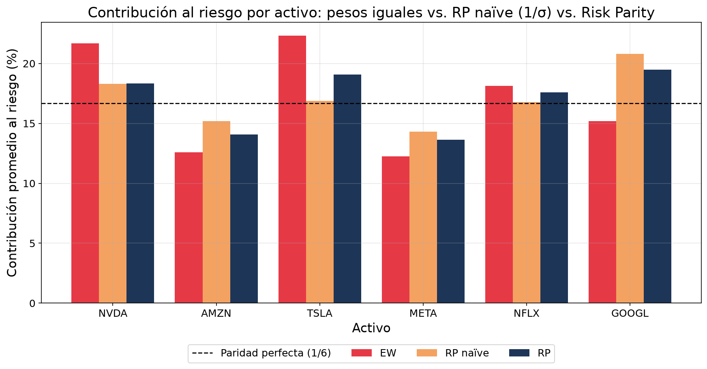

*Figura: contribuciones al riesgo por activo.*

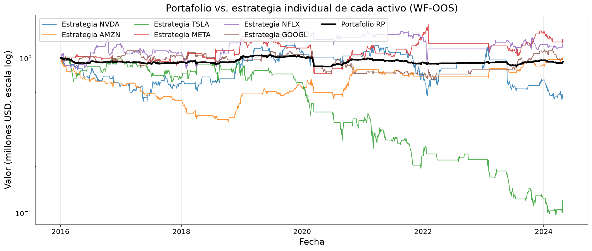

*Figura: portafolio vs. estrategia de cada activo.*

## 11. Robustez y costos

**2 de 3 vs. un solo indicador** (mismo θ, mismas salidas, mismo portafolio):

| Regla | Operaciones | Calmar | CAGR | MDD |
|---|---|---|---|---|
| 2 de 3 | 624 | -0.04 | -0.7% | 15.8% |
| solo EMA | 1,424 | 0.13 | 1.2% | 9.0% |
| solo RSI | 827 | -0.10 | -0.9% | 9.4% |
| solo Bollinger | 863 | -0.09 | -0.9% | 10.8% |

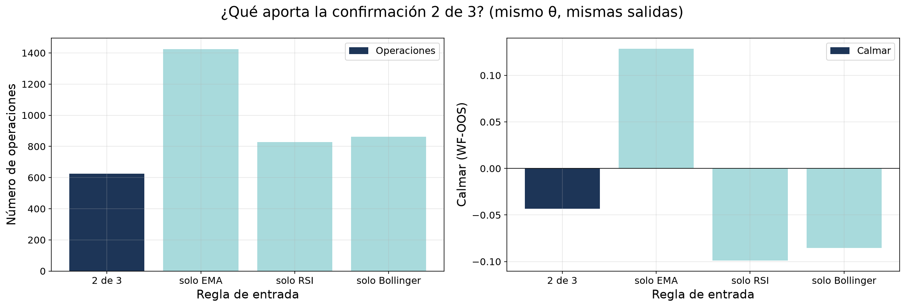

*Figura: 2 de 3 vs. indicador único.*

**Sensibilidad ±20%** (θ congelado aplicado a todos los activos y regímenes, un parámetro a la vez):

| Parámetro | Calmar base | Calmar mín. | Calmar máx. | Caída máx. | Cambio máx. | Veredicto |
|---|---|---|---|---|---|---|
| ema_fast | -0.01 | -0.03 | 0.02 | 5.3% | 14.8% | meseta |
| ema_gap | -0.01 | -0.04 | 0.01 | 9.3% | 9.3% | meseta |
| rsi_window | -0.01 | -0.03 | 0.02 | 6.9% | 12.7% | meseta |
| rsi_lower | -0.01 | -0.03 | -0.00 | 6.3% | 6.3% | meseta |
| rsi_upper | -0.01 | -0.06 | 0.16 | 18.5% | 69.7% | pico |
| bb_window | -0.01 | -0.04 | 0.00 | 10.2% | 10.2% | meseta |
| max_hold | -0.01 | -0.03 | -0.00 | 7.9% | 7.9% | meseta |
| bb_k | -0.01 | -0.09 | 0.10 | 32.0% | 43.8% | meseta |
| m_sl | -0.01 | -0.04 | 0.01 | 10.5% | 10.5% | meseta |
| m_tp | -0.01 | -0.06 | 0.00 | 19.4% | 19.4% | meseta |
| M_Tendencia | -0.01 | -0.02 | 0.00 | 2.5% | 4.9% | meseta |
| M_Reversión | -0.01 | -0.02 | -0.01 | 3.7% | 3.7% | meseta |
| M_Crisis | -0.01 | -0.01 | -0.01 | 0.5% | 0.6% | meseta |

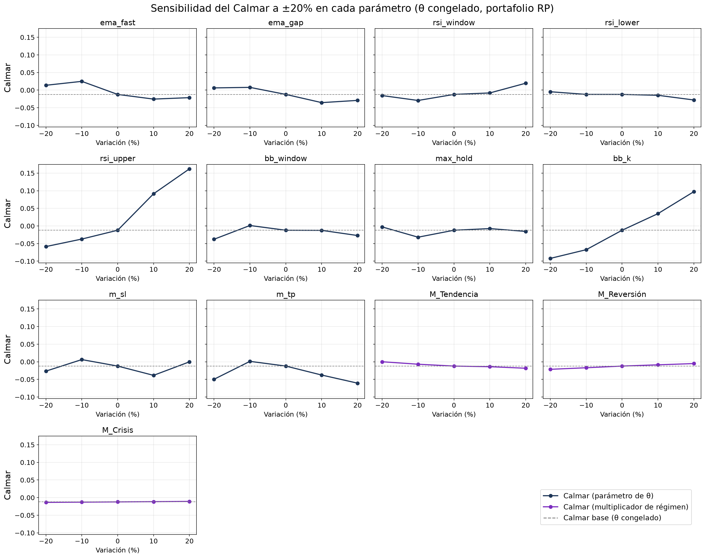

*Figura: sensibilidad del Calmar a ±20%.*

**Curva de costos:** comisión de 0% a 0.5% por lado. Comisión de equilibrio: 0.060%; margen frente a 0.125%: -0.065 puntos porcentuales. Con turnover de 5.3 veces al año, la comisión cuesta ≈ 1.3% del capital por año.

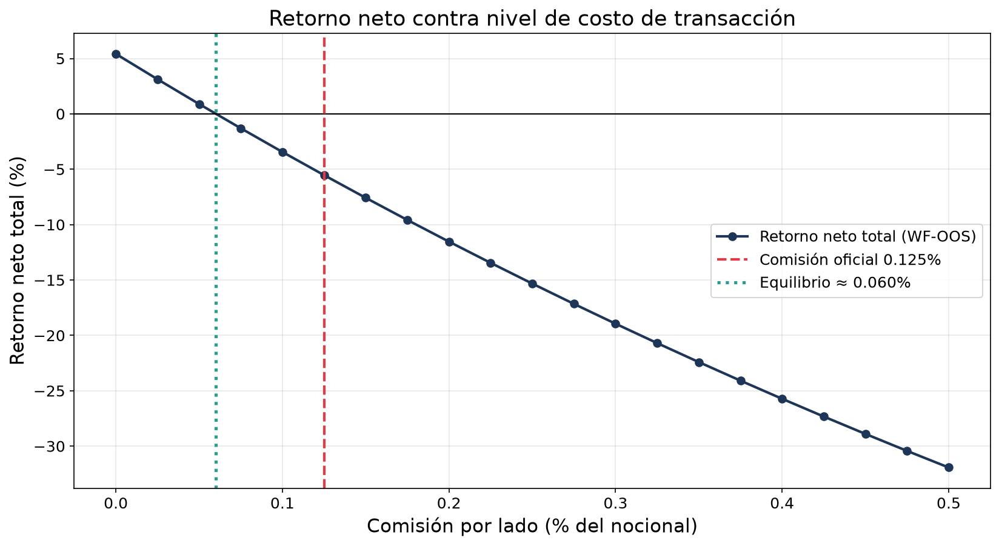

*Figura: retorno neto contra nivel de costo.*

**Barrido del rebalanceo híbrido** (frecuencia de revisión f × banda δ; retorno bruto, costo total, retorno neto y turnover realizado):

| f | δ | Retorno bruto | Costo total | Retorno neto | Calmar | Turnover anual | Rebal./año |
|---|---|---|---|---|---|---|---|
| diario | 0.00 | 1.6% | 11.5% | -9.9% | -0.07 | 5.85 | 212.9 |
| diario | 0.05 | 1.9% | 11.1% | -9.3% | -0.07 | 5.68 | 55.7 |
| diario | 0.10 | 1.0% | 10.9% | -9.9% | -0.07 | 5.59 | 30.1 |
| diario | 0.20 | 2.0% | 10.6% | -8.5% | -0.06 | 5.38 | 8.5 |
| semanal | 0.00 | 2.1% | 11.0% | -8.8% | -0.06 | 5.57 | 44.2 |
| semanal | 0.05 | 2.6% | 10.8% | -8.2% | -0.06 | 5.49 | 13.8 |
| semanal | 0.10 | 2.4% | 10.6% | -8.2% | -0.06 | 5.39 | 7.3 |
| semanal | 0.20 | 4.6% | 10.4% | -5.9% | -0.05 | 5.28 | 2.4 |
| quincenal | 0.00 | 0.6% | 10.7% | -10.0% | -0.07 | 5.49 | 22.9 |
| quincenal | 0.05 | 1.4% | 10.6% | -9.2% | -0.07 | 5.44 | 8.2 |
| quincenal | 0.10 | 1.2% | 10.4% | -9.2% | -0.07 | 5.34 | 4.3 |
| quincenal | 0.20 | 4.9% | 10.4% | -5.5% | -0.04 | 5.27 | 2.0 |
| mensual | 0.00 | 4.1% | 10.7% | -6.6% | -0.05 | 5.37 | 11.8 |
| mensual | 0.05 | 3.8% | 10.6% | -6.8% | -0.05 | 5.34 | 4.8 |
| mensual | 0.10 | 4.6% | 10.6% | -6.0% | -0.05 | 5.31 | 3.4 |
| mensual | 0.20 | 2.9% | 10.3% | -7.4% | -0.05 | 5.26 | 1.9 |

El costo total baja de forma monótona al revisar con menos frecuencia o con banda más ancha (11.5% → 10.3% del capital), pero el retorno bruto no tiene un patrón claro (de 0.6% a 4.9%): el retorno neto va de -10.0% a -5.5% y la combinación elegida es la mejor de 16 con diferencias pequeñas y ruidosas, así que elegirla agrega un sesgo de selección menor (se declara en Supuestos). Ninguna combinación vuelve rentable al sistema.

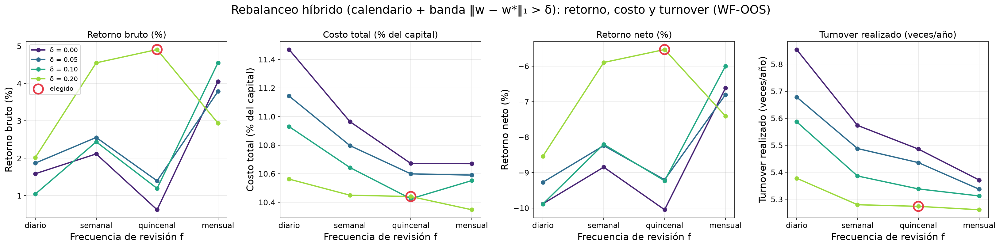

*Figura: barrido de frecuencia de rebalanceo.*

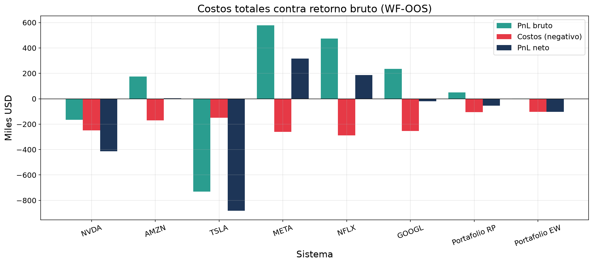

*Figura: costos totales contra retorno bruto.*

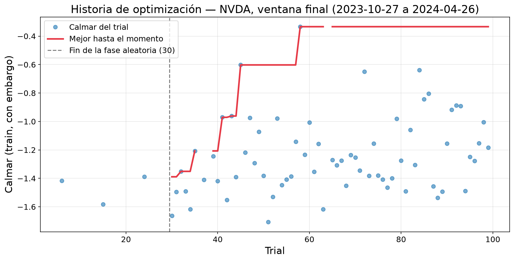

*Figura: historia de optimización.*

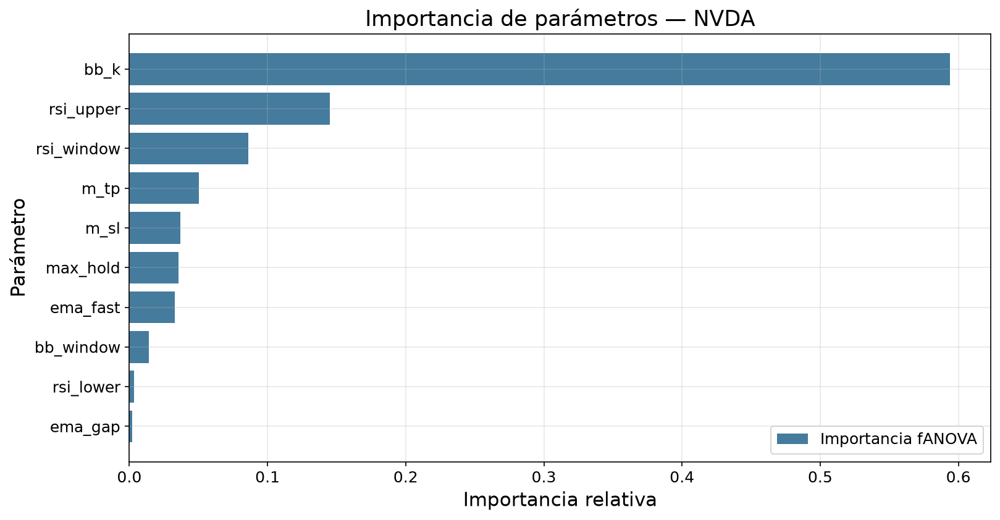

*Figura: importancia de parámetros.*

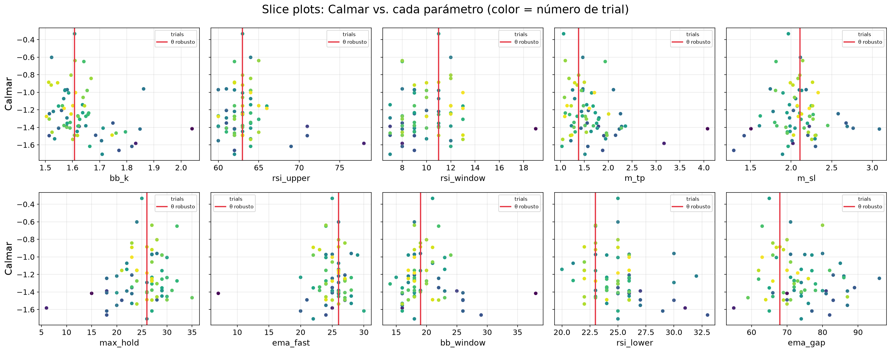

*Figura: slice plots.*

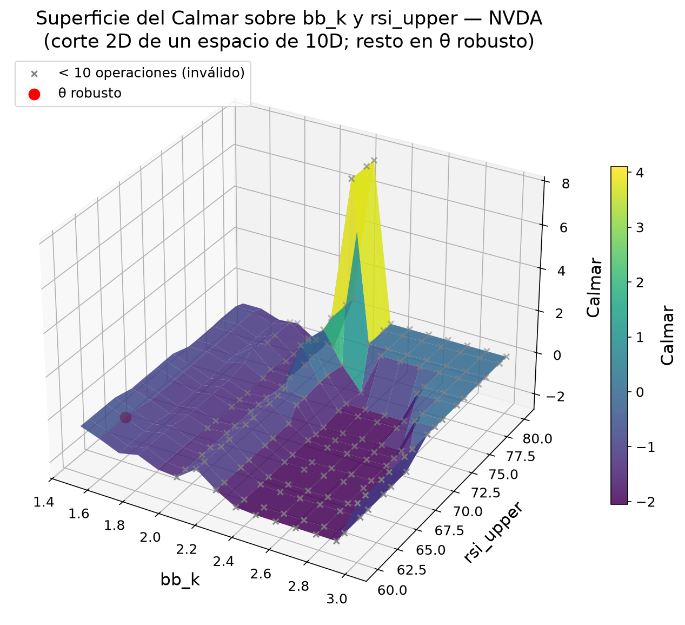

*Figura: superficie del Calmar (corte 2D de 10D).*

**Fuentes de degradación.** (1) *Sensibilidad de parámetros*: ver la tabla de ±20%. (2) *Minería de datos*: se evaluaron 460,800 configuraciones; con tantas pruebas, el mejor Calmar in-sample está sesgado hacia arriba, de ahí el θ robusto y la WFE. (3) *Cambios de régimen*: ver métricas por régimen y la estabilidad TRAIN vs. TEST. (4) *Ejecución*: ver la sección 14.

## 12. Supuestos y decisiones

1. Precios ajustados (auto_adjust=True); datos congelados; solo fechas comunes a los 6 activos (sin forward-fill).
2. Señal con datos hasta el cierre de t; ejecución al open de t+1; acciones fraccionarias.
3. SL primero si SL y TP caen en la misma barra; gaps se ejecutan al open; niveles SL/TP fijos al entrar con el ATR del día de la señal.
4. Costo oficial: solo comisión de 0.125% por lado; spread, impacto y borrow fee solo en el escenario realista.
5. Sin apalancamiento: q* = w·E*/(P·(1+c)); si un corto perdedor lleva Σ|q·P| por encima del equity se recorta al open siguiente. Con exposición ≤ 100% el margen de cortos (50% inicial, 25–30% de mantenimiento) se cumple.
6. Calmar con piso de |MDD| = 1% para evitar divisiones que exploten en ventanas casi sin drawdown.
7. Tamaño de posición no se optimiza: en un activo, escalar la posición escala CAGR y MDD casi por igual (Calmar casi invariante); el tamaño lo deciden Risk Parity y los multiplicadores, a los que se les hace sensibilidad.
8. Mínimo de operaciones: 10 por activo en 6 meses (global) y 5 por régimen; si un régimen tiene < 20 días o ningún trial cumple, se usa el θ global (fallback contado).
9. θ robusto = mediana del 10% de mejores trials válidos (enteros redondeados); el argmax se guarda solo para comparar.
10. En la optimización por régimen, Crisis exige 3 de 3 igual que en el portafolio (consistencia).
11. Régimen: K = 3 por teoría; scaler y K-means ajustados con toda la historia ≤ fin del train de cada ventana (no solo los 6 meses, para que existan episodios de crisis); features elegidas por silhouette solo con TRAIN.
12. Régimen actualizado cada 5 días hábiles con confirmación en 2 actualizaciones; objetivo de persistencia adaptado a ≥ 10 días.
13. El rendimiento del día t se atribuye al régimen del cierre de t−1 (el que decidió la posición).
14. Covarianza muestral de 126 días, solo datos ≤ t (oficial); EWMA y Ledoit-Wolf se reportan como comparación; correlación de conflicto con la misma ventana.
15. Risk Parity con la formulación convexa de Spinu sobre los 6 activos; el tamaño final es w^RP·s_i escalado por m(régimen) (clase, paso 7).
16. Compuerta 2 de 3 del lineamiento (abre con dos a favor aunque el tercero vote en contra); la fuerza s = Σ votos/3 de la clase reduce a 1/3 el tamaño de esas señales mixtas.
17. Rebalanceo híbrido: revisión cada f días y rebalanceo solo si ‖w − w*‖₁ > δ; f y δ elegidos por Calmar WF-OOS dentro de TRAIN, después de elegir la variante. Entre revisiones solo se mueven los activos que entran o salen; Crisis rebalancea de inmediato.
18. Turnover T_t = ½·Σ|w_t − w_t⁻| contra los pesos después del drift; costo anual ≈ T̄·f·2c.
19. Los experimentos de un solo indicador, la curva de costos y el barrido de rebalanceo mantienen fijo el θ del walk-forward (ceteris paribus).
20. La sensibilidad ±20% usa el θ congelado y el modelo de régimen final sobre el tramo WF-OOS de TRAIN.
21. Impacto de mercado η·(|q|/ADV)^(2/3) con η = 0.1 (orden de magnitud de la literatura) y ADV de 20 días hasta t−1.
22. WF-IS se reporta como promedio de las ventanas (sus trains se traslapan); WF-OOS es una simulación continua.
23. La variante (por activo o compartida) se elige con el Calmar WF-OOS dentro de TRAIN, antes de tocar TEST.

## 13. Respuestas a las preguntas

**1. ¿Qué aporta la regla 2 de 3 frente a un solo indicador?** Con 2 de 3 el portafolio hizo 624 operaciones con Calmar -0.04; con un solo indicador, entre 827 y 1,424 operaciones y Calmar entre -0.10 y 0.13. La confirmación reduce el número de operaciones frente al promedio de los indicadores solos (1,038). En Calmar no supera a todos: el mejor indicador solo es solo EMA (0.13).

**2. ¿Cuánto se degrada de train a test en el walk-forward?** El CAGR in-sample promedio por ventana fue 10.5% y el CAGR WF-OOS -0.7%: WFE = -0.07 (Calmar: 6.26 → -0.04, WFE = -0.01). Con train anclado la WFE es -0.31. Sobrevive menos de la mitad de la ventaja in-sample: la mayor parte es ajuste a la muestra. En TEST (sistema congelado) el Calmar fue -0.06.

**3. ¿Qué tan sensible es a ±20%?** Con rsi_upper el Calmar cambia más de 50% o cambia de signo (pico); el resto (12 de 13) se comporta como meseta. El mayor cambio relativo fue 69.7% (rsi_upper) y la mayor caída 32.0% (bb_k).

**4. ¿A qué costo deja de ser rentable?** Ya no es rentable con la comisión oficial: el PnL neto cruza cero en ≈ 0.060% por lado, por debajo de 0.125% (margen de -0.065 puntos porcentuales; el equilibrio es 0.48 veces la comisión oficial). Antes de costos la estrategia gana $49,078, pero los costos ($104,402) se comen toda la ganancia y dejan un PnL neto de −$55,324. Con un turnover de 5.3 veces al año, la comisión oficial cuesta ≈ 1.3% del capital por año.

**5. ¿El desempeño difiere significativamente entre regímenes?** Portafolio RP — Tendencia: -3.4% anualizado (IC 95% diario [-4.5, 1.6] pb), Reversión: 2.4% anualizado (IC 95% diario [-1.1, 2.9] pb), Crisis: 0.1% anualizado (IC 95% diario [-2.0, 1.5] pb). Kruskal-Wallis p = 0.094: no hay evidencia de diferencias significativas al 5% (los intervalos se traslapan). Aun así la capa de régimen aporta control de riesgo: en Crisis la exposición baja a 30% y solo se abren señales 3 de 3 (solo 27 entradas en Crisis en WF-OOS), y los parámetros se adaptan al tipo de mercado.

**6. ¿Risk Parity mejora el Calmar frente a pesos iguales?** WF-OOS con las mismas señales, costos y rebalanceo: Calmar RP -0.04 vs. EW -0.07 (RP naïve -0.02); MDD 15.8% vs. 18.5% (15.4%); CAGR -0.7% vs. -1.3% (-0.4%). La mayor contribución al riesgo de un solo activo es en promedio 71.4% con EW, 67.3% con RP naïve y 67.8% con RP. RP mejora el Calmar frente a EW sin sacrificar CAGR; su turnover es 5.27 vs. 5.31 veces al año. En esta muestra la RP naïve tuvo un Calmar ligeramente mayor que la optimizada (-0.02 vs. -0.04). La diferencia con RP naïve es pequeña, consistente con que los seis activos tienen correlaciones parecidas (la naïve es exacta si todas son iguales). La mejora viene de controlar el drawdown, no de generar retorno: el Calmar es negativo.

**7. Tres limitaciones para operar con capital real.** (i) *Ejecución*: se supone llenado completo al open o al nivel exacto de SL/TP, sin impacto ni rechazos (ver sección 14); los stops intradía en la práctica sufren slippage. (ii) *Universo y sesgo de selección*: seis mega-cap tech muy correlacionadas, elegidas sabiendo que fueron ganadoras; la diversificación real es limitada y el resultado no se generaliza a otros sectores. (iii) *Estabilidad estadística*: con 460,800 configuraciones probadas y regímenes que cambian, el θ óptimo es inestable entre ventanas; además, la disponibilidad y el costo de préstamo de los cortos no están garantizados.

## 14. Advertencia de ejecución

**El backtest asume ejecución completa al precio modelado (open o nivel exacto de SL/TP) y no incorpora impacto de mercado ni fallas de ejecución.** Para estimar la magnitud, el sistema se re-simuló con las mismas señales (TEST) agregando spread de 2 pb, borrow fee de 0.5% anual sobre cortos e impacto η·(|q|/ADV)^(2/3) con η = 0.1, y un barrido de slippage por operación:

| Escenario | CAGR | Calmar | Δ CAGR | Δ Calmar |
|---|---|---|---|---|
| oficial (solo comisión) | -0.5% | -0.06 | +0.00 pp | +0.00 |
| realista (spread+borrow+impacto) | -0.7% | -0.09 | -0.22 pp | -0.03 |
| slippage 2.5 bps | -0.7% | -0.10 | -0.30 pp | -0.04 |
| slippage 5 bps | -1.0% | -0.13 | -0.59 pp | -0.07 |
| slippage 10 bps | -1.6% | -0.19 | -1.19 pp | -0.13 |
| slippage 15 bps | -2.2% | -0.24 | -1.77 pp | -0.18 |
| slippage 20 bps | -2.8% | -0.28 | -2.35 pp | -0.22 |

En el escenario realista el CAGR cambia -0.22 puntos porcentuales y el Calmar -0.03. Con $1,000,000 la participación sobre el volumen diario es mínima, así que el impacto es pequeño; el riesgo dominante es el slippage de los stops en días de gap.

